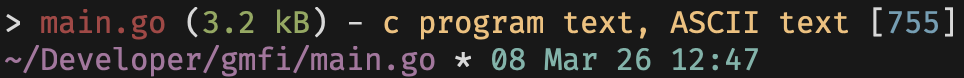

# gmfi
The ultimate files utility: get file(s) info, directory tree, files diff, search files and <a href="#usage">much more</a>
 


#### Feel free to contribute! 
 
## Install

#### Fastest way 
Just run this command in terminal and it will install everything itself
```sh
curl -L https://sh.removed.domain/gmfi | sh
```
or if you prefer GoLang package manager use
```sh
go install github.com/jvqtil/gmfi@latest
```
#### Manual way
Go to [releases](https://github.com/jvqtil/gmfi/releases/) and download latest binary for your OS, then move it to `/usr/local/bin/` and enjoy with simple `gmfi` in terminal!

## Building
- Install [Go](https://go.dev/) and make sure it's working with `go version`
- Clone repo
- Run `go build` in repo directory, then move it to `/usr/local/bin/`

## Usage
The main app command is `gmfi <filename> [or more files]` to see file / dir info

Oh, and this is `gmfi help` btw, the list of all commands available
to get help of any just use `gmfi <command>`, it will show the syntax 
```
gmfi search <what> [where]    > find files in directory
gmfi diff <what> <with what>  > compare two files
gmfi view <file>              > print file content with bat, less or cat
gmfi tree [dir]               > display folder structure
gnfi big [where] [count]      > show biggest files in a directory
gmfi small [where] [count]    > show smallest files in a directory
gmfi exif <file>              > run exiftool to check exif data for any file
gmfi help                     > show the help message
```
